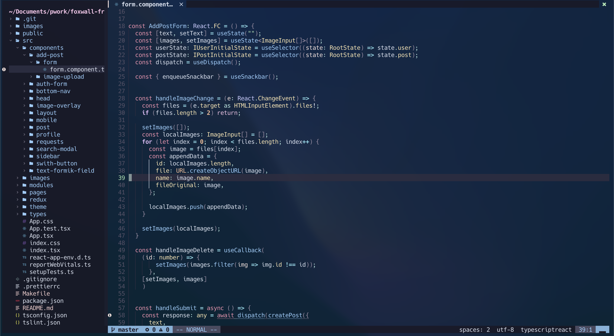
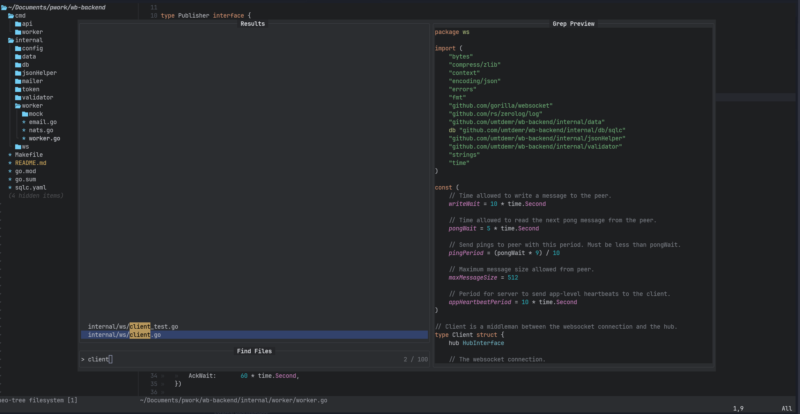

# Neovim

This is my neovim configuration. I inspired a lot from [lunar vim from stratch series](https://github.com/LunarVim/Neovim-from-scratch). I highly recommend to check it out.

## Features

- Written in [Lua](https://www.lua.org/)
- Neovim's own Lsp configured by [nvim-lspconfig](https://github.com/neovim/nvim-lspconfig)
- Easy Language Server installation with [nvim-lsp-installer](https://github.com/williamboman/nvim-lsp-installer)
- File searching, greping, and much more with [telescope.nvim](nvim-telescope/telescope.nvim) a.k.a. fuzzy finder on steroids
- Autocopletion with [nvim-cmp](https://github.com/hrsh7th/nvim-cmp)
- Snippets by [luasnip](https://github.com/L3MON4D3/LuaSnip) and [friendly-snippets](https://github.com/L3MON4D3/LuaSnip)
- More sane snippet usage with [cmp_luasnip](https://github.com/saadparwaiz1/cmp_luasnip)
- Easy commenting with [Comment.nvim](https://github.com/numToStr/Comment.nvim)
- Colorscheme [catppuccin.nvim](https://github.com/catppuccin/nvim)
- File management with [nvim-tree.lua](https://github.com/kyazdani42/nvim-tree.lua)
- Easy access to terminal with [toggleterm.nvim](akinsho/toggleterm.nvim)
- Markdown preview [glow.nvim](https://github.com/ellisonleao/glow.nvim)

For full plugin information please check out [plugins.lua](https://github.com/umtdemr/Dotfiles/blob/master/.config/nvim/lua/user/plugins.lua)

## Screenshots

## TO DO
- [ ] Configure keymaps for renaming, code action etc.
- [ ] Lsp saga may be useful for better UI
