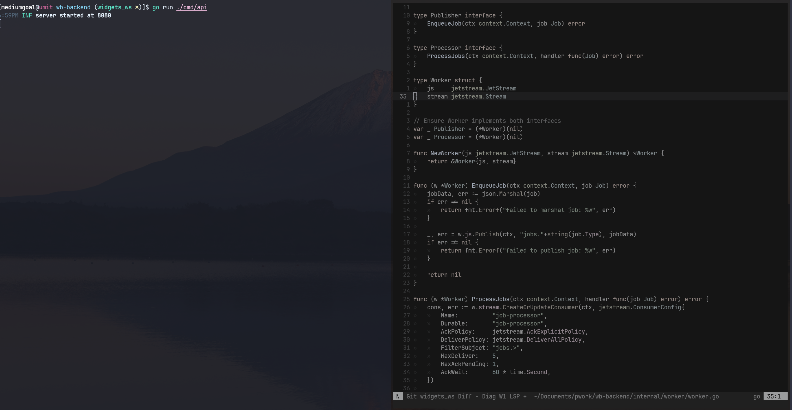

# umtdemr's Dotfiles

This is umtdemr's terminal setup. 

## Content

This setup includes:

* Zsh
* Neovim
* WezTerm

## Terminal

In Macos, I've started to use [WezTerm](https://wezfurlong.org/wezterm/index.html "Wez's Terminal Emulator") over [alacritty](https://github.com/alacritty/alacritty "Alacrity's github page") and [iTerm2](https://iterm2.com/index.html). I wrote [a blog post](https://umitde.com/blog/i-switched-to-wezterm) about my reasons for this change.

* Terminal: WezTerm
* Shell: ZSH

## Neovim

I'm using nightly neo vim with [LSP](https://github.com/neovim/nvim-lspconfig) features. For more information about my neovim configuration please check out [neovim folder](https://github.com/umtdemr/Dotfiles/tree/master/.config/nvim)

## ZSH

* Theme: gianu
* Additional plugins: zsh-autosuggestions, zsh-syntax-highlighting
