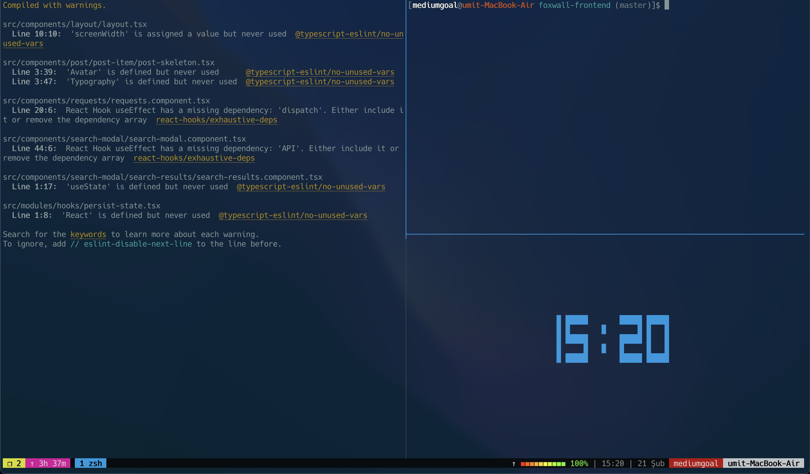

# Mediumgoal's Dotfiles

This is mediumgoal's (umtdemr) terminal setup. 

**Warning**: Do not use blindly my settings. I copied my settings from someone else's settings. For neovim check out [Takuya's dotfiles](https://github.com/craftzdog/dotfiles-public)   

## Content

* Tmux conf
* Zsh Conf
* (Neo)Vim conf

## Neovim

I'm using nightly neo vim with bult-in LSP features.

* Theme: catpuccin