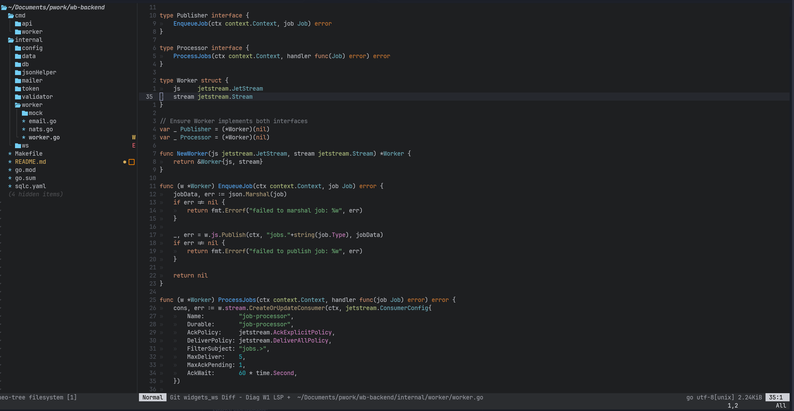

# Mediumgoal's Dotfiles

This is mediumgoal's (umtdemr) terminal setup. 

Do not use my settings blindly. Only do it if you know what you do.

## Content

This setup including:

* Tmux
* Zsh
* Neovim

## Terminal

In macos, I've started to use [iTerm2](https://iterm2.com/ "iTerm2's official page") instead of [alacritty](https://github.com/alacritty/alacritty "Alacrity's github page"). But I suggest alacritty if you are using linux based operation systems.

* Terminal: iTerm2
* Color scheme: Solarized Dark
* Shell: ZSH

## Neovim

I'm using nightly neo vim with [LSP](https://github.com/neovim/nvim-lspconfig) features. For more information about my neovim configuration please check out [neovim folder](https://github.com/umtdemr/Dotfiles/tree/master/.config/nvim)

## ZSH

* Theme: gianu 🤟
* Additional plugins: zsh-autosuggestions, zsh-syntax-highlighting
